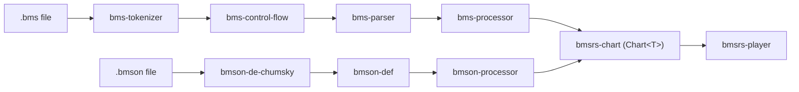

# bmsrs

## 项目定位

BMS（Be-Music Script）/ BMSON 谱面格式解析、转换与模拟播放的 Rust 工作空间。
输出统一的 `Chart<T>` 中间表示，供渲染层/播放器消费。

> **⚠️ 预发布状态**：当前 `0.1.0` 版本尚未发布，仍在积极开发中。所有公开接口可随时变动，无需遵循 semver 兼容性。若涉及跨 crate 的架构性变更或 breaking API 修改，向用户确认即可。

## 管道图



## Crate 职责矩阵

| Crate | 定位 | 输入 → 输出 | 零依赖？ |
|-------|------|-------------|---------|
| `bms-tokenizer` | BMS 语法分析第一关：原始文本 → 结构化 token 流 | `&str` → `BmsToken<C>` | 否（proc-macro）|
| `bms-tokenizer-derive` | `#[derive(BmsTokenAttr)]` proc-macro | 无运行时逻辑 | — |
| `bms-control-flow` | `#RANDOM`/`#SWITCH` 分支选择与 roundtrip | `BmsToken[]` → `FlowDoc<P>` | 否（rand）|
| `bms-parser` | BMS 语义分析：flat token → `Bms` 模型 | `BmsToken[]` → `Bms` | 否（bms-tokenizer）|
| `bms-processor` | `Bms` → 格式无关 `Chart` | `Bms` → `Chart` | 否（bms-parser + chart）|
| `bmson-def` | bmson JSON 类型定义（v0/v1/v2） | 纯数据模型 | 是（dev-only serde_json）|
| `bmson-de-chumsky` | bmson JSON 反序列化（chumsky 实现） | 替代 serde 的自定义 parser | 否 |
| `bmson-processor` | `Bmson` → `Chart` | `Bmson` → `Chart` | 否 |
| `bmsrs-chart` | 格式无关的谱面数据模型 | `Chart<T>` = 中央 IR | **是** |
| `bmsrs-player` | `Chart<T>` 纯仿真层 | 时间轴查询，无 I/O/渲染 | **是** |
| `bmsrs` | 公共 re-export facade | `pub use` 聚合 | 是 |

外部依赖统一通过 `[workspace.dependencies]` 管理，不直接在各 crate `Cargo.toml` 中指定版本。

## 命令

### 提交前自动执行（pre-commit hooks）

```bash
pre-commit run --all-files          # 手动触发全部 hook
```

Hook 配置于 `.pre-commit-config.yaml`：

| Hook | 作用 | 失败意味着 |
|------|------|-----------|
| `cargo fmt --check` | 格式未格式化 | 运行 `cargo fmt` |
| `cargo clippy --workspace --all-targets -- -D warnings` | Lint 不通过 | 修复警告 |
| `RUSTDOCFLAGS="-D warnings" cargo doc --workspace --no-deps` | API doc 有 warning | 修复 doc 问题 |
| `no-comment-decorations` | 装饰性注释块 | 移除 `// ===`、`// ---` 等装饰 |
| `no-confusable-unicode` | Unicode 混淆字符 | 替换为 ASCII 等价字符 |

### 手动执行

```bash
cargo test --workspace --quiet        # 全工作区测试
cargo deny check                       # 依赖审计（CI）
```

## 约定

### 提交格式

Conventional Commits，匹配 `release-plz.toml` changelog 分组。类型见下表：

| 类型 | changelog 分组 | scope 示例 |
|------|---------------|-----------|
| `feat:` | 🚀 Features | `feat(bms-parser):` |
| `fix:` | 🐛 Bug Fixes | `fix(tokenizer):` |
| `refactor:` | 💅 Code Refactoring | `refactor(processor)!:` |
| `perf:` | ⚡ Performance | `perf(player):` |
| `test:` | ✅ Tests | `test(parser):` |
| `docs:` | 📚 Documentation | `docs(chart):` |
| `ci:` | 👷 CI | — |
| `security:` | 🔒 Security | — |
| `deprecated:` | 🗑️ Deprecated | — |
| `revert:` | ⏪ Revert | — |

- Title/body 用中文（type 与 scope 仍用英文，如 `docs(chart):`）
- body 可选，无特殊情况可省略
- breaking change 用 `!`：`feat!:` 或 `feat(scope)!:`
- `!` 放在冒号前

### MSRV 与 Edition

| 项目 | 值 |
|------|-----|
| MSRV | 1.88 |
| Edition | 2024（`resolver = "3"`）|

### Lint 约定

- 工作区统一 `[lints]` 配置：`allow_attributes = "deny"`
- **禁止** `#[allow]`，始终用 `#[expect(clippy::lint, reason = "...")]`
- clippy `all` + `pedantic` 默认启用

### API 设计

公开操作通过类型的关联函数暴露（结构体或零大小 `*Builder`），**禁止**自由函数作为公开 API。
仅当 API 有可配置参数时使用 `*Builder`；无状态时直接用结构体方法。
私有操作**建议**同样按上述模式设计（挂在类型上而非自由函数），尤其当多个函数共享同一组参数或逻辑上属于同一转换过程时；但不强制——纯函数式辅助、无共享状态的简单工具函数保留为自由函数即可。

### 注释风格

- 公开项用 `///`，模块用 `//!`（clippy 强制）
- `//` 用于实现内部说明，不用来写文档
- 文档注释（`///`、`//!`）与实现注释（`//`）一律用中文；
  BMS/bmson 领域术语参照 bms / bmson skill 中的译法，代码标识符用反引号保留英文
- rustdoc 标准段标题（`# Errors`、`# Panic`、`# Example` 等）保留英文

### 测试规范

| 方面 | 规则 |
|------|------|
| 命名 | `<场景>_<期望>`，如 `empty_input_returns_empty_bms` |
| 断言数 | 每个 test 一个断言 |
| 公开 API 测试 | 放 `tests/*.rs`（集成测试）；**禁止**在 `src/` 内测公开 API |
| `pub(crate)`/ 私有测试 | 放 `src/*.rs` 内 `#[cfg(test)] mod` |
| 优先测试公开类型 | 避免测试内部 `Wrap` 结构体 |
| 防重复 | 新增测试前检查同 crate 的 `tests/` 与 `src/` 内 `#[cfg(test)] mod`，避免覆盖重复；仅当现有测试无法覆盖新场景时才新增 |

### 版本发布

- 由 release-plz CI 管理版本、CHANGELOG.md、git tag
- **禁止**手动修改版本号、创建 changelog、打 tag

## Always / Ask / Never

### Always

- 修改后运行 `pre-commit run --all-files`（或等 hook 自动触发）
- commit message 符合 Conventional Commits + scope；subject/body 用中文（type/scope 用英文）
- 每个提交只做一个逻辑变更，`feat:` + `fix:` 不混入同提交
- 文档注释（`///`、`//!`）与实现注释（`//`）一律用中文，代码标识符用反引号保留英文
- 新增 crate 时在 `bmsrs/` 和根 AGENTS.md 中添加对应的 `pub use` 和记录

### Ask

- 新增非 workspace 的外部依赖
- 修改 `.pre-commit-config.yaml` 或 CI 配置
- 跨 crate 的架构性重构（移动模块、重命名公开类型）

### Never

- 手动修改 `Cargo.toml` 中的版本号
- 创建或修改 CHANGELOG.md
- force push 到 main 分支
- 引入 `serde` / `serde_json` 等序列化依赖到 `bmsrs-chart` 或 `bmsrs-player`
