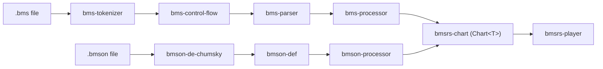

# bmsrs

## Commands

### Pre-commit (auto on commit)

```bash
pre-commit run --all-files            # manually trigger all hooks at once
```

Hooks configured: `cargo fmt --check`, `cargo clippy --workspace --all-targets -- -D warnings`, `RUSTDOCFLAGS="-D warnings" cargo doc --workspace --no-deps`, `no-comment-decorations` (rejects decorative comment blocks), `no-confusable-unicode` (detects confusable Unicode dashes/spaces).

### CI / manual only

```bash
cargo test --workspace --quiet
cargo deny check
```

## Crates

| Crate | Directory | Summary |
|---|---|---|
| `bmsrs` | `bmsrs/` | Re-export facade |
| `bms-tokenizer` | `bms/tokenizer` | First stage of `tokenizer → control-flow → parser` |
| `bms-tokenizer-derive` | `bms/tokenizer-derive` | Proc-macro for `#[derive(BmsTokenAttr)]` |
| `bms-control-flow` | `bms/control-flow` | Generic `FlowDoc<P>` control-flow tree, branch selection, roundtrip, payload mapping |
| `bms-parser` | `bms/parser` | Structured `Bms` model from flat token stream |
| `bms-processor` | `bms/processor` | `Bms` → `Chart` conversion processor |
| `bmson-def` | `bmson/def` | bmson format type definitions (v0/v1/v2) |
| `bmson-de-chumsky` | `bmson/de-chumsky` | bmson JSON deserializer (chumsky) |
| `bmson-processor` | `bmson/processor` | `Bmson` → `Chart` conversion processor |
| `bmsrs-chart` | `common/chart` | Format-agnostic chart data model |
| `bmsrs-player` | `common/player` | Pure simulation layer for `Chart<T>` |

All dependencies (local and external) use `workspace = true` — see `[workspace.dependencies]` in root `Cargo.toml`.

## Pipeline



## Commit format

Conventional Commits matching `release-plz.toml` changelog groups:
`feat:` / `fix:` / `refactor:` / `perf:` / `test:` / `docs:` / `ci:` / `security:` / `deprecated:` / `revert:`

- Title/body in English.
- Use `()` for scope, e.g. `feat(bms-parser):`.
- Use `!` for BREAKING CHANGE, e.g. `feat!:` or `feat(scope)!:`.

## Release

Versions, CHANGELOG.md, and git tags are managed by release-plz CI —
do not manually bump versions, create changelogs, or tag releases.

## Comment style

- Use doc comments (`///` for items, `//!` for modules) for all API
  documentation — clippy enforces docs on all items.

## Lint convention

Workspace enforces `allow_attributes = "deny"`. Use
`#[expect(clippy::lint, reason = "...")]` to suppress — never `#[allow]`.

## API convention

Expose public operations through associated functions on a relevant type
(typically a domain struct or a zero-sized `*Builder`). Avoid free functions
as public API — namespacing on a type is mandatory for consistency.
Prefer a `*Builder` only when the API has configurable parameters; a
bare struct with methods is sufficient when there is no state to configure.

## MSRV & edition

- Minimum Rust version: **1.85**.
- Edition: **2024** (`resolver = "3"`).

## Testing

- Test naming: `<scenario>_<expectation>`.
- One assertion per test. Prefer testing edge cases through public types
  over internal `Wrap` structs.

### Test placement

| Tests for | Location |
|---|---|
| Public API | `<crate>/tests/*.rs` (integration) |
| `pub(crate)` / private | `src/*.rs` `#[cfg(test)] mod` (inline) |
