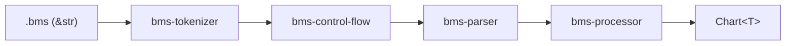

# bms/ — BMS 格式解析管道

## 定位

BMS（Be-Music Script）格式解析管道。`.bms` 原始文本经四阶段管道转换为格式无关的 `Chart<T>`。

## 管道



| 阶段 | Crate | 职责 |
|------|-------|------|
| 1 词法 | `bms-tokenizer` | 原始文本 → `BmsToken<C>` |
| — 派生 | `bms-tokenizer-derive` | `#[derive(BmsTokenAttr)]` proc-macro，无运行时逻辑 |
| 2 控制流 | `bms-control-flow` | `#RANDOM`/`#SWITCH` 分支选择与 roundtrip |
| 3 语义 | `bms-parser` | flat token → `Bms` 模型 |
| 4 转换 | `bms-processor` | `Bms` → `Chart` |

## 设计原则

| 原则 | 含义 |
|------|------|
| 分层不越界 | tokenizer 不做跨命令验证、control-flow 不依赖 parser、parser 不展开控制流、processor 不引入 I/O |
| 泛型贯穿 | `C`（`&str` 零拷贝或 `String` owned）和 `P`（负载类型）由调用侧选择，贯穿管道 |
| 模式族解耦 | 键位映射通过零大小类型实现 `BmsLayout` trait，不在 `Chart` 中存储模式信息 |

## 职责判据

核心原则：**`Bms` 保真映射**——`Bms` 字段是 BMS 文件内容的直接结构化表示，不存需要计算或语义解释才能得到的派生值。

| 层 | 做什么 | 判据 |
|----|--------|------|
| tokenizer | 语法 + 单行值解释 + 局部引用校验 | 单行内可独立完成 |
| parser | 为 `Bms` 保真必需的跨命令处理 | 不做就无法保真还原文件 |
| processor | `Bms` → `Chart` 的信息损失型转换 | 涉及合并 / 引用解析 / 查表 |

**tokenizer 局部引用校验**三层：id 格式（字符集 + 长度，已由 `BmsIndex::FromStr` 覆盖）、id 范围（某些命令的 id 须落在特定段）、多字段局部一致性（同一命令内字段间关联）。

**parser 跨命令边界**：

- ✅ 保真必需：同小节同通道多行合并、`#BASE` 预扫描、索引归一化
- ❌ 转换性质：`#BGA`/`#BMP` 优先级、引用解析、def 表查表——归 processor

**派生值禁止**：`Bms` 字段须能经 roundtrip 还原出原 BMS 文件。若字段值由其他字段计算或语义解释得到（如 `damage = base36 / 2`），改存原始字面值，派生计算移 processor。

## 领域术语

BMS 命令、通道映射、头部字段等术语参照 **bms skill**（`~/.agents/skills/bms/`）。
该 skill 是索引——具体命令语义须查阅其 `memo/`、`ext/`、`bmse/`、`test/` 子目录。

## 测试

```bash
cargo test -p bms-tokenizer
cargo test -p bms-control-flow
cargo test -p bms-parser
cargo test -p bms-processor
# bms-tokenizer-derive 通过 bms-tokenizer 的 roundtrip 测试间接验证
```

## 域级约束

### Never

- 在 BMS 管道 crate 中引入 `serde` / 序列化依赖——序列化属于 bmson 域
