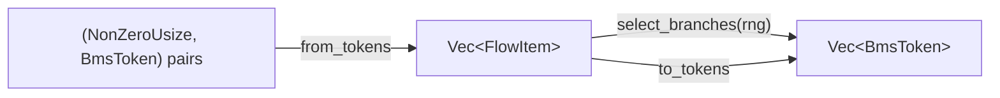

# bms-control-flow

Second stage: tokenizer → **control-flow** → parser.
Builds `Vec<FlowItem>` tree from tokens, selects branches via RNG, roundtrips.

All operations go through `FlowDocumentBuilder` (zero-sized struct, all
methods are associated functions):



```rust
let items = FlowDocumentBuilder::from_tokens(tokens)?;
let (flat, sel) = FlowDocumentBuilder::select_branches(&items, rng);
let tokens = FlowDocumentBuilder::to_tokens(&items);
```

`from_tokens` input bundles line numbers. Caller filters `Result` from tokenizer first.

## Selection

- **`#RANDOM`**: first matching branch wins. No match → silent empty (no error).
- **`#SWITCH`**: first matching case → fall-through output until `has_skip` stops chain.
- **`BranchValue::Max(n)`** calls RNG; **`BranchValue::Set(n)`** uses fixed value.

## Nesting

`#IF`/`#ENDIF` route to nearest `RandomBlock`; `#CASE`/`#SKIP` to nearest `SwitchBlock`.
Blocks opened inside a branch (e.g. `#SWITCH` inside `#IF 1`) stay contained.
Missing `#ENDRANDOM` → block silently discarded (stack not flushed).

## Types

- `RandomBlock.has_end_random` — true iff `#ENDRANDOM` present.
- `SwitchCase.has_skip` — true iff `#SKIP` present. `Kind: Case(u64)` or `Def`.

## Tests

```bash
cargo test -p bms-control-flow
```

Helpers `SequenceRng`, `DeterministicRng`, `find_seed`, `build_doc` defined in test files.
