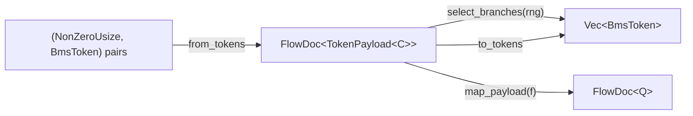

# bms-control-flow

Second stage: tokenizer → **control-flow** → parser.
Builds `FlowDoc<TokenPayload<C>>` from tokens, selects branches via RNG,
roundtrips, and derives payload views via `map_payload`.

## Core model

`FlowDoc<P>` carries payload type `P` at each content span. Consecutive
non-control-flow tokens are packed into a single payload node; control-flow
commands become structured `FlowBlock` nodes.



```rust
let tree = FlowDoc::from_tokens(tokens)?;
let (flat, sel) = tree.select_branches(&mut rng);
let tree2 = FlowDoc::from_tokens(tokens)?;
let flat2 = tree2.to_tokens();
```

`from_tokens` input bundles line numbers. Caller filters `Result` from
tokenizer first. `FlowDoc<TokenPayload<C>>` is the token-level source of
truth (editable, roundtrippable).

## Payload generality

`FlowDoc<P>` is generic over the payload type `P`. `TokenPayload<C>` is the
built-in token-level payload. Use `map_payload` / `try_map_payload` to derive
other payload views while preserving the control-flow skeleton — e.g. a
downstream crate builds `FlowDoc<Bms>` from `FlowDoc<TokenPayload<C>>`:

```rust
let bms_tree: FlowDoc<Bms> = token_tree.map_payload(|TokenPayload { tokens }| {
    Bms::from_flat_tokens(tokens.into_iter().map(|(_, t)| t))
});
```

`FlowDoc<Bms>` is a read-only view: `to_tokens` / `select_branches` are only
available on `FlowDoc<TokenPayload<C>>`. This crate does **not** depend on
`bms-parser`; the `Bms` view is constructed downstream.

## Selection

- **`#RANDOM`**: first matching branch wins. No match → silent empty (no error).
- **`#SWITCH`**: first matching case → fall-through output until `has_skip` stops chain.
- **`BranchValue::Max(n)`** calls RNG; **`BranchValue::Set(n)`** uses fixed value.

## Nesting

`#IF`/`#ENDIF` route to nearest `RandomBlock`; `#CASE`/`#SKIP` to nearest `SwitchBlock`.
Blocks opened inside a branch (e.g. `#SWITCH` inside `#IF 1`) stay contained.
Missing `#ENDRANDOM` → block silently discarded (stack not flushed).

Opening a nested block flushes the current scope's pending tokens into a
payload node first, so span ordering is preserved across block boundaries.

## Tests

```bash
cargo test -p bms-control-flow
```

Helpers `SequenceRng`, `DeterministicRng`, `find_seed`, `build_doc` defined in test files.
`map_payload_tests` covers payload transformation and skeleton preservation.
