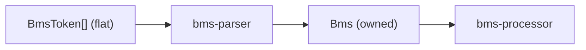

# bms-parser

## 定位

BMS 语义分析：flat token 流（无控制流命令）→ 结构化 `Bms` 模型。
属于 `tokenizer → control-flow → parser` 管道的第三阶段。

## 管道位置



## 设计哲学

**信息保留优先。** 原始元数据值原样存储，不做推断或转换。

| 不做什么 | 理由 |
|----------|------|
| 隐式副标题解析 | `#TITLE` 分隔符推断属于播放器层，parser 保留原始 `#TITLE` 和 `#SUBTITLE` |
| 值解释（路径、URL、邮箱） | 字符串原样保留 |
| 控制流展开 | 由 `bms-control-flow` 处理 |

## 生命周期

`Messages` 使用两阶段设计：

| 阶段 | 方法 | 作用 |
|------|------|------|
| 1. 收集 | `concat_raw` | 追加 body 字符串到 `(measure, channel)` |
| 2. 最终化 | `finalize(base)` | 解析事件，position-merge，归一化索引 |

`Bms::from_flat_tokens` 自动调用 `finalize`；手动构造时须显式调用。
`finalize` 可重复调用（先 clear），但建议只调用一次。

## Header 分发

| 状态 | 变体 | 存储策略 |
|------|------|----------|
| 存储 | Metadata, Gameplay, Timing, Display, Audio, Visual, `Fallback` | Option(最后胜出) / BTreeMap(按 ID) |
| 跳过 | ControlFlow | 由 `bms-control-flow` 处理 |

### 消息通道处理策略

| 通道类型 | 策略 |
|----------|------|
| BGM（ch 01） | 每行独立处理（多声部支持）|
| 小节长（ch 02） | 最后一行胜出 |
| 选项（ch A6）及其他通道 | position-merge（非 `"00"` 覆盖，`"00"` 保留）|

## 非显而易见的规则

| 规则 | 说明 |
|------|------|
| 小节长值为比值 | `1.0` = 4/4，`0.75` = 3/4，`2.0` = 8/4。非百分比。 |
| 地雷伤害计算 | Base36 值 / 2.0，`ZZ` = 即死 (`f64::INFINITY`) |
| `finalize(base)` 参数 | 控制索引归一化：Base36 → 大写，Base62 → 保留原大小写 |
| 事件索引均通过 `normalize(base)` | 确保与定义表的 key 大小写匹配 |
| `"00"` 在不同通道语义不同 | note 通道 = 无音符（skip），BPM ch03 = 休止（skip），LN/ext 通道 = 有效值 |

## Always / Ask / Never

### Always

- 所有索引值（Wav/Bmp/Bpm/Stop/Scroll/Speed）通过 `normalize(base)` 创建
- 添加新事件类型时在 `Messages` 和 `lib.rs` re-export 中注册
- 在 AGENTS.md 中记录新事件类型的通道/语义

### Ask

- 修改 `finalize` 的处理策略（影响通道合并行为）
- 新增需要特殊合并语义的通道

### Never

- 在 parser 层实现引擎特定的推断（如隐式副标题）
- 假设 `"00"` 在所有通道都表示"无操作"

## 测试

```bash
cargo test -p bms-parser
```

公开 API 测试在 `tests/` 目录中；`merge_channel` 算法测试保留 inline。
