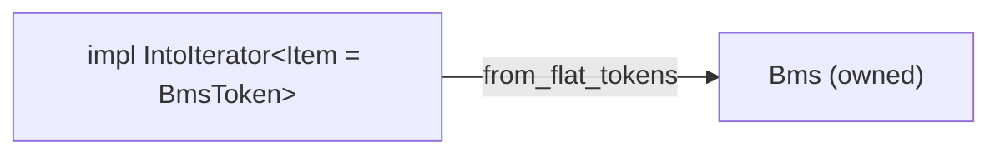

# bms-parser

Third stage: tokenizer → control-flow → **parser**.
Builds owned `Bms` struct from flat tokens (no control-flow commands).

## Lifecycle

`Messages` uses a two-phase design: `concat_raw` collects data, `finalize`
parses events.  `Bms::from_flat_tokens` calls `finalize` automatically at the
end — manual callers must call it explicitly.

Calling `finalize` while events are already populated will clear and
re-parse them.  Idempotent only when called once per load cycle.

## Design goals

1. **Semantic parse + info preservation** — Domain-typed `Bms`, not raw commands.
   Discard only what has no semantic interpretation.
2. **Editability** — `Bms` is the editing API. Mutate fields, re-serialize.
   No raw token manipulation.



## Header dispatch

- `Option` fields use last-wins semantics.
- `BTreeMap` fields (resource defs, messages) index by ID/key.
- Channel messages use a **two-phase** flow:
  1. `concat_raw` appends body strings per `(measure, channel)`.
  2. `finalize` iterates all raw pairs once, parses events with correct
     `(numer, denom)` based on the **final** total object count per channel.

All recognized header groups are stored. Only `ControlFlow` headers
(handled by `bms-control-flow`) are skipped.

| Status | Variants |
|--------|----------|
| Stored | Metadata, Gameplay, Timing, Display, Audio, Visual, `Fallback` |
| Skipped | `ControlFlow` (domain of `bms-control-flow`) |

## Tests

```bash
cargo test -p bms-parser
```
