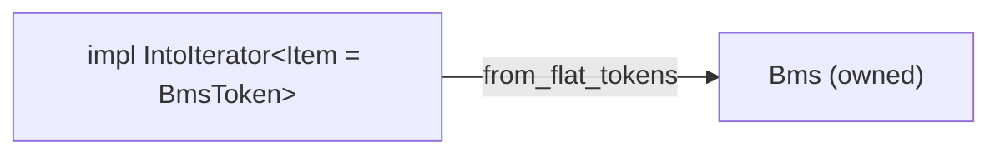

# bms-parser

Third stage: tokenizer → control-flow → **parser**.
Builds owned `Bms` struct from flat tokens (no control-flow commands).

## Design goals

1. **Semantic parse + info preservation** — Domain-typed `Bms`, not raw commands.
   Discard only what has no semantic interpretation.
2. **Editability** — `Bms` is the editing API. Mutate fields, re-serialize.
   No raw token manipulation.



## Header dispatch

Last-wins for `Option` fields; `BTreeMap` for resource defs and messages.
Messages also last-wins per `(measure, channel)`.

| Status | Variants |
|--------|----------|
| Stored | Metadata, Gameplay, Timing, Display, Resource defs, `Fallback` |
| Skipped | `ControlFlow` |
| Silently dropped | `WavCmd`, `Cdda`, `Midifile`, `ExBmp`, `Bga`, `AtBga`, `SwBga`, `Argb`, `ExtChr`, `VideoFps`, `VideoColors`, `VideoDly`, `OctFp`, `Option`, `Stp` |

## Tests

```bash
cargo test -p bms-parser
```
