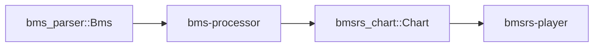

# bms-processor

## 定位

`Bms` → 格式无关 `Chart` 的转换处理器。
通过 `BmsLayout` 模式族解耦 BMS 的玩家/键位映射。

## 管道位置



## 关键转换

| 转换 | 输入 | 输出 | 说明 |
|------|------|------|------|
| 音符 | `NoteEvent` + `LongNoteEvent` + `MineEvent` | `Event::Note` | LNOBJ 消耗的 note 从普通音符中排除 |
| 时序 | `BpmChange` + `StopEvent` + `MeasureTable` | `TimingTrack` | 小节长通过 `length_ratio` (f64) 计算 |
| BGM | `BgmEvent` | `Event::Bgm` | LNOBJ 终点标记也作为 BGM 播放 |
| BGA | `BgaEvent` | `Event::Bga` | 四层（Base / Poor / Layer / Layer2）|
| 显示元数据 | `BmsHeaderDisplay` | `ChartInfo` | `#BANNER`/`#BACKBMP`/`#STAGEFILE`/`#PREVIEW` ∊ `build_metadata` |
| SCROLL | `ScrollEvent` | `Event::Scroll` | 卷轴速度倍率 |
| SPEED | `SpeedEvent` | `Event::Speed` | 视觉间距关键帧，线性插值 |

## 长音模式（自动检测）

| 模式 | 检测条件 | 配对算法 |
|------|----------|----------|
| LNOBJ | `#LNOBJ` 已定义 | 常规音符与 LNOBJ 标记配对的起止对 |
| LNTYPE 1 (RDM) | 默认（或 `#LNTYPE 1`） | ch 51–69，过滤 `"00"`，连续配对 |
| LNTYPE 2 (MGQ) | `#LNTYPE 2` | ch 51–69，`"00"` = LN 终点 |

## 定位转换

`MeasureTable` 预计算每小节的累计 tick 偏移，以处理变拍子：

```text
tick = measure_starts[measure] + numer * measure_len / denom
```

每小节长度 = `resolution * 4 * length_ratio`，其中 `length_ratio` 为 `#xxx02` 值。

## 停止转换

| 来源 | 转换公式 |
|------|----------|
| `#STOP` (ch 09) | `raw / 192.0 * resolution * 4` ticks |
| `#STP` (header) | `ms → ticks via bpm_at_tick` |

## 模式族

模式族是零大小类型，实现 `BmsLayout` trait。每个族是一个 `(player, lane) → Option<NoteData>` 的映射表。

标准族见 `layout` 模块。`Bme` 族覆盖 5K/7K/10K/14K——`#PLAYER` 不影响映射（与主流引擎一致）。

## 非显而易见的规则

| 规则 | 说明 |
|------|------|
| 默认 BPM 130 | 符合 BMS 规范，非 `0.0` |
| 事件排序 | Bar(0) → Note/BGA/BGM(1) → BPM(2) → Stop(3) → Scroll(4) → Speed(5) |
| LNOBJ 终点 BGM | 终点标记过判定线时播放定义的 WAV |
| LNOBJ 下 ch51-69 | 与 LNOBJ 互斥（memo/10 未定义）；不丢弃，作为普通可见音符保留 |
| 地雷 `damage: 1.0` | 已修复为实际伤害值（见 `MineEvent.damage`）|
| `process_default` 使用 `Bme` | 而非基于 `#PLAYER` 推断；PMS 等模式需显式指定 |
| 转换步骤归属 `BmsConverter` | `collect_*`/`build_*` 是 `BmsConverter` 方法，非自由函数 |

## Always / Ask / Never

### Always

- 新事件类型在 `BmsConverter` 的 `collect_*` 方法中注册 + 在 `process` 中调用
- 更新 `Event::tick()` match 表达式以包含新变体

### Ask

- 新增模式族（修改 `layout` 模块的通道映射）
- 修改事件优先级顺序（影响同 tick 事件排序）

### Never

- 在处理器中引入 I/O、渲染、判定逻辑
- 修改 `Chart` 的数据模型（属于 `bmsrs-chart` crate）
- 引入 `serde` / 序列化依赖

## 测试

```bash
cargo test -p bms-processor
```
