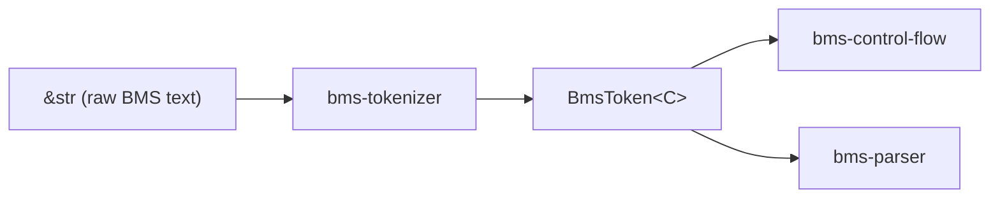

# bms-tokenizer

## 定位

BMS 语法分析第一关：原始文本 → 结构化 token 流。
属于 `tokenizer → control-flow → parser` 管道的第一阶段。

## 管道位置



## 关键设计决策

| 决策 | 选择 | 原因 |
|------|------|------|
| 通道分类时机 | tokenizer 阶段 | cipher 下游 parser 无需重复解析通道号 |
| 值语义保留 | 不解析，保留 raw index | 下游 parser 根据 `#BASE` 模式决定索引语义 |
| 字符集 | Base62（最宽松） | 统一入口，`#BASE` 声明在 parser 层生效 |
| 注释预处理 | 独立 `preprocess()` 函数 | 保持 tokenizer 零拷贝路径不受影响 |
| `C` 泛型 | `&str`（零拷贝）或 `String`（owned） | 调用侧选择，贯穿管道 |

## 目标

每个 token 的存在只为两个目的：
1. **Roundtrip 保真** — `format_header` 还原原始行
2. **语法校验** — 验证格式正确性

## 泛型容器 `C`

`BmsToken<C>` / `BmsHeader<C>` / `BmsMessage<C>` 用单个类型参数承载字符串容器。
调用侧在 `tokenize` 时选择，贯穿管道：

```rust
// C = &str（零拷贝，借用自输入）
let tokens: Vec<(_, _)> = BmsTokenizer::new().tokenize(input);
// C = String（owned）
let owned: Vec<(_, _)> = BmsTokenizer::new().tokenize::<_, String>(input);
```

## 新增 Header

在对应的 domain enum 中添加 `#[bms_token("...")]` 变体，derive 自动生成一切。

三层解析：

| 层级 | 机制 | 失败路径 |
|------|------|----------|
| Command match | derive 匹配命令名，提取 `{id}` | 不匹配 → `BmsHeaderFallback` |
| Value parse | derive per-field：`C` / `FromStr` / `BmsValue::parse` | 解析失败 → error（`#[bms_fallback]` 则返回 `None`） |
| Fallback | `#[bms_fallback]` 捕获未匹配 | → `BmsHeaderFallback` |

### Value 类型

- 实现 `BmsValue<'a, C>`（或 `FromStr + Display` —— 对所有 `C` 有 blanket impl）
- `ParseBmsValueError` / `BmsChannelIdError` / `ParseDifficultyError` 已内置 `IntoTokensError`
- 自定义 `FromStr` 类型可实现 `IntoTokensError` 选择错误变体

## 非显而易见的规则

| 规则 | 说明 |
|------|------|
| `BmsIndex` 比较大小写敏感 | 标准 BMS 在 parser 层 normalize 为大写；Base62 模式保留原大小写 |
| `parse_message_line` / `parse_header_line` 对集成测试可见 | 已 re-export，测试可直接调用 |
| `#` + `%` 是默认 header 前缀 | 可通过 `BmsTokenizer::header_prefixes()` 自定义 |
| 三行结尾格式均支持 | LF / CRLF / standalone CR |
| `//` 和 `;` 行首注释 | tokenizer 主循环跳过；inline `//`（含 `"..."` 字符串保护）也由主循环处理；`/* */` 和 `;` 行中注释仍由 `preprocess()` 处理 |

## Always / Ask / Never

### Always

- `#[expect(...)]` 替代 `#[allow(...)]`
- 新增 header 时在对应 domain enum 加 `#[bms_token("...")]` 变体
- 每新增一个 se 变体，检查是否需要 `From<T>` / `TryFrom<T>` 到 parent

### Ask

- 新增 `BmsChannel` 变体（涉及通道分类映射，需确认通道号表）
- 修改 `C` 泛型的 trait 约束（影响下游管道）

### Never

- 在 tokenizer 层解析 WAV/BMP 引用语义（属于 parser 层）
- 引入 `serde` / 序列化依赖
- 修改 `BmsIndex` 的比较语义
