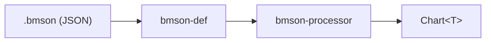

# bmson/ — BMSON 格式解析管道

## 定位

BMSON（BMS 的 JSON 序列化格式）解析管道。`.bmson` JSON 经解析、类型定义、转换三阶段生成格式无关的 `Chart<T>`。

核心设计理念：播放器运行时对音频切片，无需制谱者预切音效。

## 管道



| 阶段 | Crate | 职责 |
|------|-------|------|
| 类型定义 + 反序列化 | `bmson-def` | BMSON 纯数据模型（v0/v1/v2），支持 serde 反序列化 |
| 转换 | `bmson-processor` | `Bmson` (v2) → `Chart` |

## 版本模型

bmson 有三个 schema 版本：v0.21、v1.0、v2.0。v2 是 root schema——
v0/v1 必须先通过 `Bmson::from` / `TryFrom` 升版到 v2 才能被 processor 处理。

## 设计原则

| 原则 | 含义 |
|------|------|
| 类型定义与解析合一 | `bmson-def` 直接通过 `serde` 支持 JSON 反序列化，无需独立解析层 |
| 模式族解耦 | `BmsonLayout` 零大小类型解耦键位映射，`mode_hint` 决定分发 |
| 音频预切片 | `SoundChannel` 在启动时预切片为 `AudioAsset` 数组，运行时按索引查 |

## 领域术语

BMSON 字段、schema 版本差异等术语参照 **bmson skill**（`~/.agents/skills/bmson/`）。
该 skill 是索引——具体字段语义须查阅其 `spec/`、`ext/` 子目录。

## 测试

```bash
cargo test -p bmson-def
cargo test -p bmson-processor
```

## 示例

```bash
cargo run --example bmson_parser -p bmson-def
```
