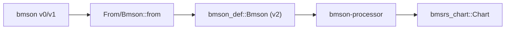

# bmson-processor

## 定位

`bmson_def::Bmson` (v2 root schema) → `Chart` 的转换处理器。
通过 `BmsonLayout` 模式族解耦键位映射。

## 管道位置



v0/v1 文件先通过 `Bmson::from` 升版到 v2 schema。

## 模式族

| 类型 | 实现 | 用途 |
|------|------|------|
| 无状态 ZST | `impl BmsonLayout` | 简单模式，`process::<T>(bmson)` |
| 有状态 decoder | 不实现 `BmsonLayout` | 运行时配置（键数），`process_nkeys(bmson, keys)` |

`process_default` 根据 `mode_hint` 分发：

| mode_hint | 模式族 |
|-----------|--------|
| beat / dj | `Beat` |
| popn | `Pms` |
| 通用 | `GenericLayout` |

## 声音通道切片

每个 `SoundChannel` 在启动时预先切片为 `AudioAsset` 数组，
每一切片以唯一 Note 脉冲为边界。运行时的音符事件通过索引查预切好的 asset。

见内部 `slice` 模块。

## 非显而易见的规则

| 规则 | 说明 |
|------|------|
| BGM 音符丢弃 | 同脉冲有可演奏音符时，BGM 音符 (`x: 0`) 被丢弃 |
| 事件排序 | Note/BGA → BPM → Stop |
| v0/v1 必须先升版 | 不支持直接处理 |

## 测试

```bash
cargo test -p bmson-processor
```
