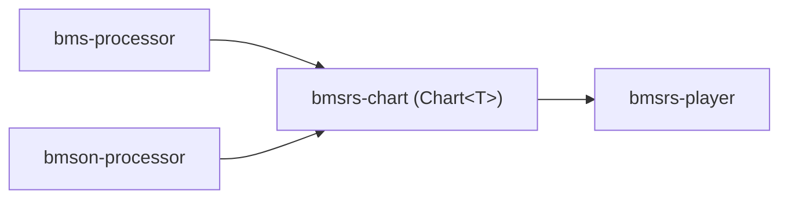

# common/ — 格式无关公共层

## 定位

格式无关的谱面数据模型与仿真层。BMS / BMSON 两条管道在此汇合——两边的 processor 都输出 `Chart<T>`。

**零外部依赖。** 纯 `std`，无 `serde`、`thiserror`、`serde_json`。

## 架构



| Crate | 职责 |
|-------|------|
| `bmsrs-chart` | `Chart<T>` 中央 IR——事件、时序、音符的格式无关模型 |
| `bmsrs-player` | `Chart<T>` 纯仿真层——基于时间的查询接口 |

## 时间模型

| 域 | 类型 | 用途 |
|------|------|------|
| Tick | `u64` | 所有事件位置、停止时长、LN 时长 |
| Time | `Duration` | `AudioAsset.start`、`Chart::duration()`、播放器公开 API |

`TimingTrack`（O(n) 线性）与 `TimingCache`（O(log n) 二分）桥接两域，语义一致、结果等价。
前者适合一次性构造，后者适合频繁换算（播放器实时查询、处理器批量切片）。两者同处 `bmsrs-chart`。

## 设计原则

| 原则 | 含义 |
|------|------|
| 零外部依赖 | 纯 `std`——序列化、错误库等由上游 crate 自行引入 |
| 无副作用 | 不含 I/O、渲染、判定、计分——纯数据与查询 |
| 模式信息不存储 | `Chart` 不存储模式族，音符已携带 `(NoteSide, Lane)` |

## 测试

```bash
cargo test -p bmsrs-chart
cargo test -p bmsrs-player
cargo bench -p bmsrs-player          # 热路径性能基准
```
